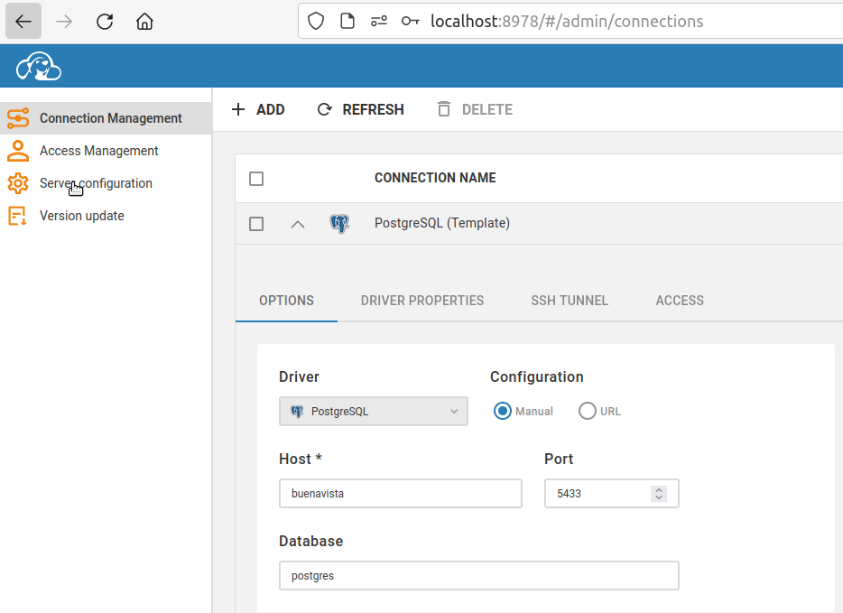

# Connecting to duckdb using cloudbeaver

To build services locally use:

		make build

To start services use:

		docker-compose up -d

Then navigate to http://localhost:8978 (cloudbeaver GUI)

Make a connection using the Postgres Template, pointing it to:

host: buenavista
port: 5433

## Screenshot

